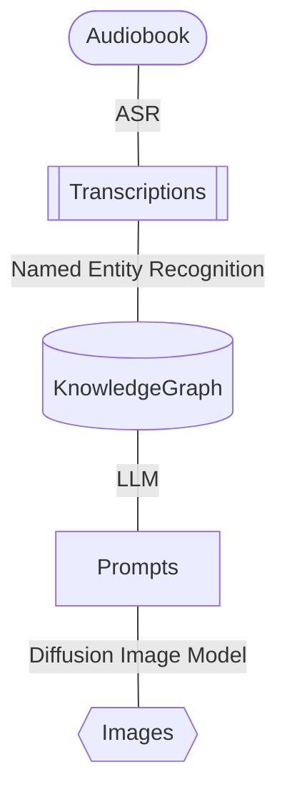

# visibl.ai

Dive into a world where every story is uniquely yours. visibl.ai transforms the tales you love into visual spectacles crafted just for you. Imagine a place where the characters, scenes, and worlds bend to your imagination, offering a personal journey through every narrative. Here, every story is an adventure tailored to your vision, making each experience distinctively yours.

## guiding principles

1. Maximize imagination
2. Have fun while doing it
3. Focus on product, not the noise

# v0

## audiobooks

Version 0 of visible is an audiobook app. The input is an audiobook, and the output is a picturebook. The album art of the book is changed as you listen to the novel. All images are unique to you, and you can change characters appearances, or overall artistic style at any time.

## the graph

Version 0 approaches the problem of prompting via a knowledge graph. The process is as follows:

Some key steps are to use a transcription model whick includes timestamps, and to add those timestamps to the knowledge graph. This allows for characters and locations to change.

The pipeline is currently chapter by chapter. 

## the api

The end result is a set of URLs of images generated by the diffusion model. The audiobook app can simply query for an image at a specific time.

## todo

There is a lot todo:
- Ability to for a user to edit the graph to change the appearance of characters and locations
- Generate images on the go
- Use midjourneys' new consistent characters feature

# major issues

## graph generation from unstructured text

NER is a mess. Currently using an LLM for NER is resulting in a lot of confusion and collapsing characters over time due to confusion.

## continuity

Right now DALL-E 3 seems to be the best model at generating complex scenes with multiple characters and settings. Dall-E 3 does not generate consistent characters, so there is virtually no continuity of characters. Midjourney is now able to generate consistent characters (`--cref`), but seems incapable of generating any image with more than one character.

## video

Where is SORA?

## project setup

These are very rough notes are the moment:
- For firebase, be sure that you enable google identity platform for your project to enable blocking functions. You do this in cloud console (not firebase console) here: https://console.cloud.google.com/customer-identity/providers?project=YOUR_PROJECT

# Contributing

Really need help with:
- NER
- iOS app

